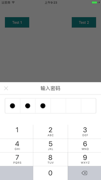
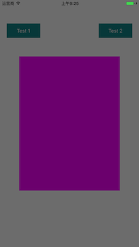

# ZZPSDInputView
仿支付宝密码输入

       

使用方法： 

```

- (IBAction)test_1:(id)sender {
    ZZAlert *sheet        = [[ZZAlert alloc] init];
    sheet.dismissWhenTouchBlank = YES;
    
    ZZPSDInputView *psdView  = [ZZPSDInputView psdInputView];
    psdView.backgroundColor  = [UIColor whiteColor];
    __weak __typeof(self) weakSelf   = self;
    __weak __typeof(sheet) weakSheet = sheet;
    psdView.cancelHandler = ^() {
        [weakSheet dismiss];
    };
    psdView.finishHandler = ^(NSString *passStr) {
        [weakSheet dismissWithCompletion:^{
            NSLog(@"完成: %@", passStr);
            weakSelf.infoLabel.text = passStr;
        }];
    };
    
    sheet.contentView = psdView;
    [sheet show];
}

- (IBAction)test_2:(id)sender {
    ZZAlert *sheet = [[ZZAlert alloc] init];
    sheet.animationStyle = ZZAlert.animationStyleTransform;
    sheet.dismissWhenTouchBlank = YES;
    UIView *purpleView = [[UIView alloc] initWithFrame:CGRectMake(0, 0, 300, 400)];
    purpleView.backgroundColor = [UIColor purpleColor];
    sheet.contentView = purpleView;
    [sheet show];
}
```

考虑到内容视图应该自定制，即ZZAlert的contentView应该是自定制的，不应该写死，此处的密码输入思路供参考。